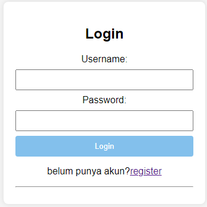

# Tranposition cpiher

### Nama    :Rizal Pringgandani
### NIM     :312110151
### Kelas   :TI.21.A2
---

### Pengenalan transposition Cipher

Hill Cipher, yang merupakan sebuah teknik enkripsi yang menggunakan matriks sebagai kunci untuk mengubah teks. Berikut penjelasan tentang metode Hill Cipher yang sesuai dengan kode di atas:

### Input dan Persiapan:

Fungsi hill_cipher digunakan untuk melakukan enkripsi dan dekripsi teks. Teks yang akan diolah diubah menjadi huruf kapital dan spasi dihilangkan. Jika panjang teks ganjil, karakter 'X' ditambahkan untuk membuatnya menjadi panjang yang genap.

### Enkripsi:

Dalam mode "encrypt", teks dipisahkan menjadi pasangan karakter. Setiap pasangan karakter diubah menjadi vektor numerik dengan mengurangkan nilai ASCII 'A' dari karakter tersebut.
Matriks kunci digunakan untuk mengalikan masing-masing pasangan karakter, dan hasilnya diambil modulo 26 (mod 26). Hasil enkripsi adalah pasangan karakter baru.

### Dekripsi:

Dalam mode "decrypt", proses yang sama dengan enkripsi dilakukan, tetapi dengan matriks kunci invers. Matriks kunci invers diperoleh dengan menghitung determinan matriks kunci, menemukan invers modulus determinan, dan menghitung matriks adjoint.
Hasil dekripsi adalah pasangan karakter asli setelah mengalami transformasi kebalikan.

### Fungsi Tambahan:

determinant: Menghitung determinan dari matriks 2x2.
matrix_multiply: Mengalikan matriks dengan skalar.
matrix_modulo: Melakukan operasi modulo pada matriks.
matrix_inverse: Menghitung matriks invers menggunakan invers modulus determinan.

### Database

[Database](https://github.com/Rizalpringgandani/UTS_KRIPTO/blob/main/CiperTranposisiTemanPiero/db_transpose.sql)

### Form Register

### Form Login

### Output 

